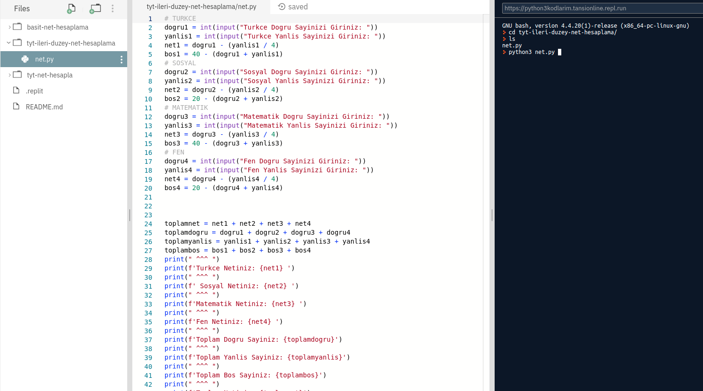
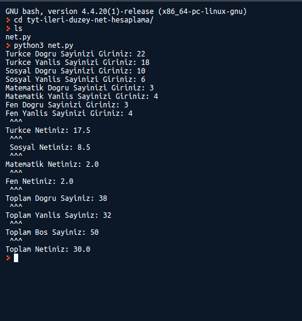

## Nasıl Calışır?

<h3>
<a href="https://repl.it/@tansionline/python3kodlarim">Repl.it</a> adresimden bütün dosyalari calistirabilirsiniz.
</h3>
 
 

## Örnek 

-cd komutu ile ilgili dosyaya erşim sağlayabilirsiniz. 

-python3 -python_dosyası ile dosyayı çalıştırabilirsiniz.

